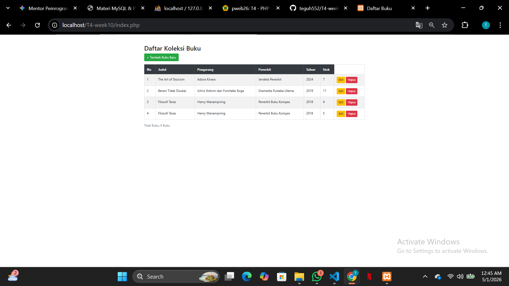
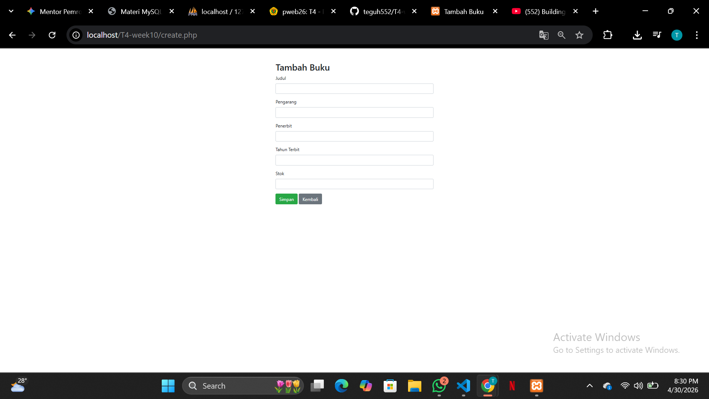
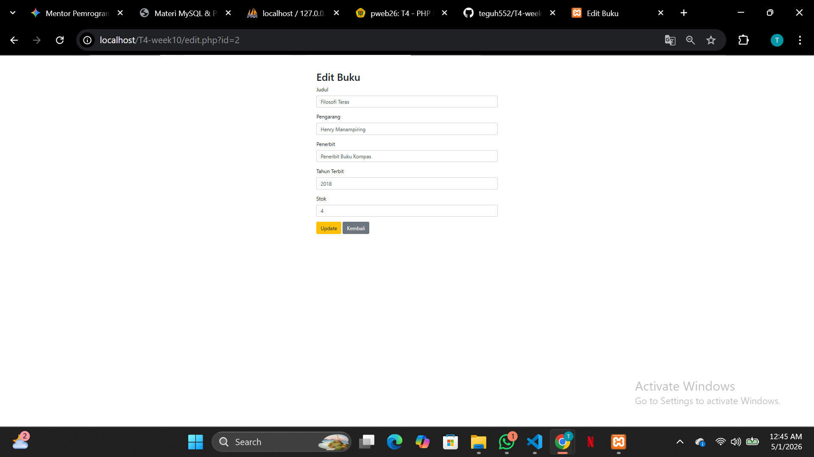
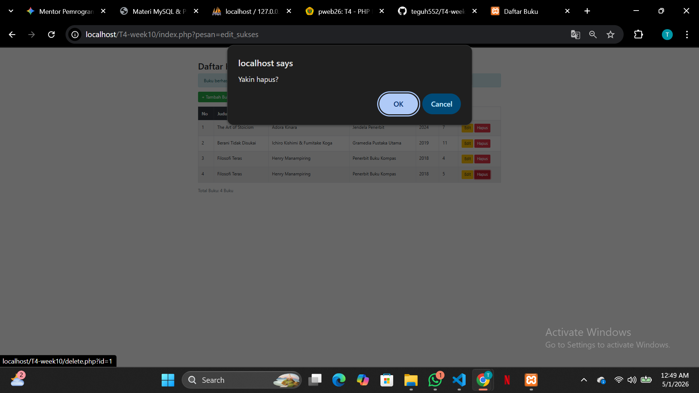
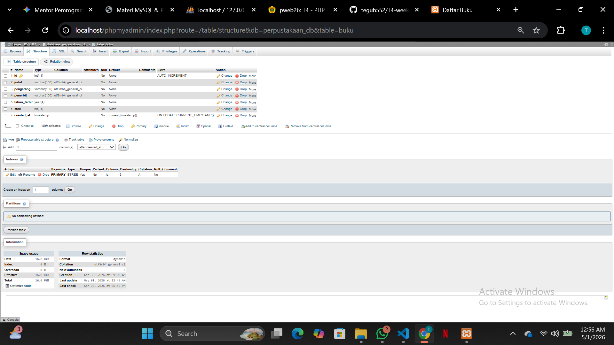

# T4-week10 - Aplikasi CRUD PHP MySQL

Nama    : Teguh Imam Azkari  
NIM     : F1D021069  
Kelas   : Pemrograman Web C

## Deskripsi
Aplikasi CRUD (Create, Read, Update, Delete) menggunakan PHP, MySQL, dan Bootstrap.

- Database  : perpustakaan_db
- Tabel     : buku

## Cara Menjalankan
1. Import file .sql ke phpMyAdmin
2. Letakkan folder project di htdocs/ (XAMPP)
3. Buka browser ke http://localhost/T4-week10/

## Screenshot

### Daftar Data

### Tambah Data

### Edit Data

### Hapus Data

### Struktur Database (phpMyAdmin)
